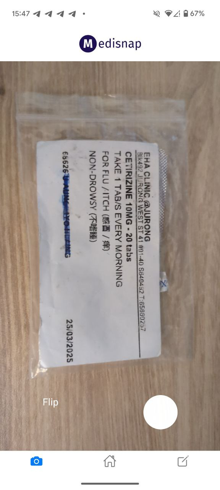
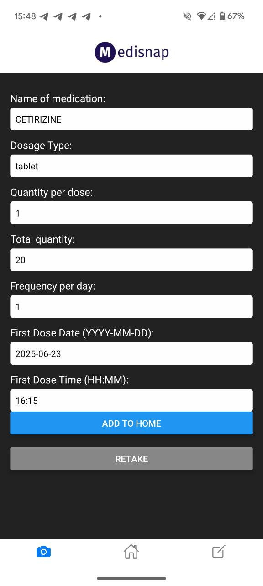

## About MediSnap

MediSnap aims to reduce **medical non-adherence** by providing a quick and simple solution to remind users of their next dosage. By leveraging OCR technology and AI, MediSnap can scan your prescription slips in seconds and send out timely and personlized reminders for all of your medications.

## Table of Contents

1. [Quick Start](#quick-start)
2. [Features](#features)
   1. [Authentication](#authentication)
   2. [Home Screen](#home-screen)
   3. [OCR](#ocr)
   4. [Manual Entry](#manual-entry)
   5. [Notifications](#notifications)
3. [Tech Stack](#tech-stack)

## Quick Start

1. Our Android apk can be found [here](https://drive.google.com/drive/folders/1_M-Xnt1yQLEqd0mJh-IClFpJwj9PsE5a?usp=sharing).
2. Install our app from the link into your Android device
3. You might receive a prompt to 'allow unknown apps' to be installed on your device. Enable this.
4. That's all! Your app will be installed onto your device :)

## Features

### Authentication

- Simple screen that can be toggled between 'sign-in' and 'sign-up'
- Users can sign up with their email address and set a password

### Home Screen

- Toggle between 'Schedule' or 'Medication' view
- Schedule: view your missed dosages and your upcoming dosages

- Medication: view your current medications and your past medication

### OCR

- Access your device's camera to take picture of prescription slips
- After parsing, a confirmation screen will be displayed
- Check details of your medication and add in the date and time of first dosage

  

### Manual Entry

- Allows users to add in their medications manually
- Medications added here will also appear on the home screen
  

### Notifications

- Notifications are sent out at the time of dosage by default
- Notifications are clickale and it brings you into the home screen of the app (if open)

## Tech Stack
- React Native
- Typescript
- Firebase
- OpenAI API
