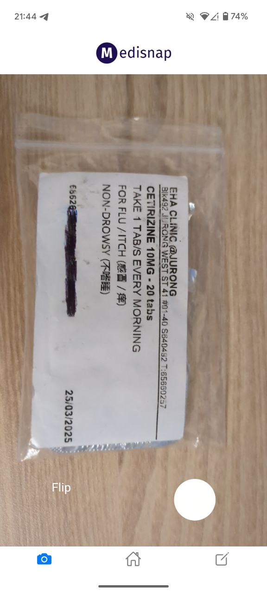

## About MediSnap

MediSnap aims to reduce **medical non-adherence** by providing a quick and simple solution to remind users of their next dosage. By leveraging OCR technology and AI, MediSnap can scan your prescription slips in seconds and send out timely and personalized reminders for all of your medications.

## Table of Contents

1. [Quick Start](#quick-start)
2. [Features](#features)
   1. [Authentication](#authentication)
   2. [Home Screen](#home-screen)
   3. [OCR](#optical-character-recognition)
   4. [Manual Entry](#manual-entry)
   5. [Notifications](#notifications)
3. [Tech Stack](#tech-stack)
4. [Testing Guide](#testing-guide)
5. [Upcoming Features](#upcoming-features)
6. [FAQs](#faqs)

## Quick Start

1. Our Android apk can be found [here](https://drive.google.com/drive/folders/1_M-Xnt1yQLEqd0mJh-IClFpJwj9PsE5a?usp=sharing).
2. Install our app from the link into your Android device.
3. You might receive a prompt to 'allow unknown apps' to be installed on your device. Enable this.
4. That's all! Your app will be installed onto your device :)

## Features

### Authentication

- Existing users can sign in with their email address and password.
- New users can toggle to the sign up page.

### Home Screen

- Toggle between 'Schedule' or 'Medication' view.
- Schedule: view your missed dosages and your upcoming dosages for today (0000 - 2359).
- Medication: view your current medications and your past medication.

 

### Optical Character Recognition

- Access your device's camera to take picture of prescription slips.
- After parsing, a confirmation screen will be displayed.
- Check details of your medication and add in the date and time of first dosage.

  

### Manual Entry

- Allows users to add in their medications manually.
- Medications added here will also appear on the home screen.

### Notifications

- Notifications are sent out at the time of dosage by default ([customizable](#customization-of-dosage-timings)).
- Notifications are clickable and it brings you into the home screen of the app.

## Tech Stack
- React Native
- Typescript
- Firebase
- OpenAI API

## Testing Guide

> 📝: Note: This is only 1 example of a user workflow, there are many other ways to use this app!

1. Sign in to the app.
2. Navigate to the camera screen and take a picture of your prescription slip.
3. On the confirmation screen, check that the extracted information is correct and set the first dosage timing to 1 minute from now.
4. The dosage card will appear on the Schedule View of the home screen, under the 'Upcoming Dosages' section.
5. After 1 minute, click on the notification.
6. The MediSnap app will open and you will receive a prompt to confirm that you have taken the dosage.
7. Once you click 'yes', that dosage card will be cleared from the Schedule View.

## Upcoming Features

### Recurring Reminders for Missed Dosages

### Customization of Dosage Timings

### Show 'Upcoming Dosages' for the Next Day

### In-app Tutorial

## FAQs

> ❓: Will this app be published on the Google PlayStore?   
> ✔️: Yes, it will be published on the PlayStore by end July!

> ❓: Will this app be available on iOS?   
> ✔️: Yes, it will be published on the Apple AppStore by mid August!
